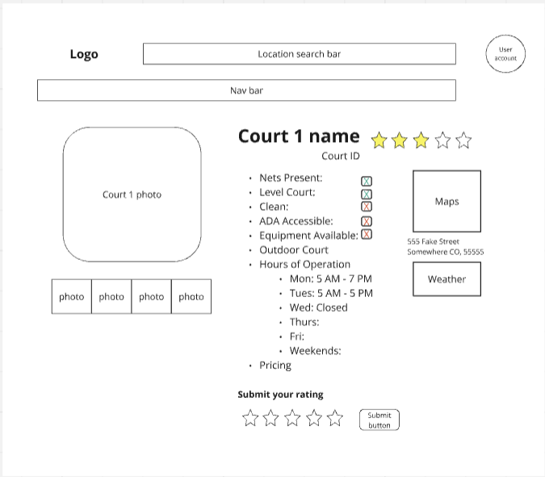

# Court Finder Descriptions

Our service has five main types of pages that we will need to design. First is a main landing page that will welcome users to our service. Next, a search result or court listing page that will allow users to find new courts. Next, a court details page that will hold the information and reviews about a particular basketball court. Next, a page for making a review and rating for a court, where users can submit their findings on a court. Finally, a favorites page where users can save courts in a list for easy access. Here we will go into detain about each type of page.

## Landing Page

- **Page Title:**

- **Page Description:**

- **Parameters:** 

- **Data Needed:**

- **Link Destinations:**

## Search Results

- **Page Title:** Search Results

- **Page Description:** This page will show the user a list of courts that match the user request given in the search bar.

* Search looks for matches in:
    Name
    Address
* Sort by:
    Rating
    Alphabetic
    Price
* Results Show:
    First Gallery Image
    Name of Court
    Average Rating
    Address
    In/Out Door
    Price

- **Parameters:** We will need the search input string given by the user to search for matches against name and address in the court table. The route will be `/search?search_entry`

- **Data Needed:** We will search the court table for matches with the search input, and display the elements of the entries that match. The data needed from that table is listed here.

* CourtID
* Name
* Rating
* Address
* In-Out Door
* Price

- **Link Destinations:** Clicking on a result will lead the user to the court details page for that result. We will need to pass the CourtID to that page. Users will be able to enter a new search, which will need the new search input. They will be able to return to the main landing page through the nav bar which will not need any info passed to it.

## Court Details

- **Page Title:** Court Details

- **Page Description:** This page will show the user all the collected information about a given basketball court. Below is a list of features with some descriptions and a picture of a wireframe for the page.

* Name of Court
* Court ID
    Unique ID for each court
    Generated upon entry creation.
    Allows courts to have similar/same names (such as YMCA)
    Allows info to be retained when changes are made, such as new court name
    Can be used to associate with other features, such as comments and photo gallery
* Average Rating
    5 Star System
    Users can enter a star rating
    Average of all user submitted ratings is displayed
* Court Quality 
    Series of features and yes no or good average bad
    Determined by user vote?
        * Nets Present
        * Level Court/No Cracks
        * Clean
        * ADA Accessible
        * Equipment Available
* In/Out Doors
    Is the basketball court in-doors or and outside court
* Hours of Operation
    May take several lines if it varies by day
    7 lines max
* Pricing Info
    Marked with the price(s) or as Free
* Location
    Address
    Connect to Google Maps
* Current Weather
    Use Address to pull weather data in the area
* Photo Gallery
    Display one or more photos of the court
* Comment Section
    User provided short reviews

- **Parameters:** We will need to get CourtID when loading the page as it will be the key parameter that is unique to a given court. The route to the page will be `/<court_id>/`.

- **Data Needed:** The table will need to hold data for each feature listed above. Here is a description of the data type.
* Name of Court (VARCHAR)
* Court ID (INT)
* Average Rating (INT:0-5)
* Nets Present (INT: Binary 1 or 0)
* Level Court/No Cracks (INT: Binary 1 or 0)
* Clean (INT: Binary 1 or 0)
* ADA Accessible (INT: Binary 1 or 0)
* Equipment Available (INT: Binary 1 or 0)
* In/Out Doors (INT: Binary 1 or 0)
* Hours of Operation (VARCHAR)
* Pricing Info (FLOAT)
* Location (VARCHAR)
* Photo Gallery Linked table with each image as a row on that table.
    * Court ID that the images are for, linked (INT)
    * Image ID (INT)
    * Image data (VARCHAR?)
* Comment Section Linked table with each comment as a row on that table.
    * Court ID that the images are for, linked (INT)
    * Comment ID (INT)
    * Text data (VARCHAR)

- **Link Destinations:** This page will link several pages. First, it will link to the Make a Review page and will need to pass the CourtID information to it so the resulting review attaches to the correct court. It will have a search bar that will lead to the Search Results page and will need to pass the info put into the search bar on to that page. It will have link in the nav bar to the Main Landing and won't need to pass any data.

## Make a Review

- **Page Title:**
    * Make a Review for [Court Name]

- **Page Description:**
    * Users can submit their review for the basketball court, rate the court on a 5-star system, and provide feedback on specific features like cleanliness, accessibility, and overall experience.

- **Parameters:** 
    * court_id: This will identify which court the review is for, allowing the review to be attached to the correct court in the database.
- **Data Needed:**
    * Reviewer’s Username: The name or username of the person submitting the review.
    * Rating: A 5-star system where users can click to select how many stars to give the court.
    * Review Text: A textbox for users to provide written feedback.
    * Date: Automatically capture the submission date.
- **Link Destinations:**
    * Court Page: Users can return to the court details page to see their review along with other reviews.
    * Other Courts: Users can be directed to a page listing other courts they may want to review or explore.
    * Search Bar: At the top of the page, allow users to search for another court to review by name or location.

## Favorites

- **Page Title:**
    * My Favorites

- **Page Description:**
    * Users can find the courts they have saved on this page.

- **Parameters:** 
    * user_id: required to get the list of court_ids that the user marked as 'favourite'
    
- **Data Needed:**
    * user_id
    * court_id
    * court_name
    * court_location
    * court_image
    
- **Link Destinations:**
    * landing page: users can select the 'home' or similar button to go back to the landing page
    * court: users can go to one of the favourited courts by clicking the card image in the favourites list
    * search bar: users can access the search bar at the top of the page to use the regular court search functionality
