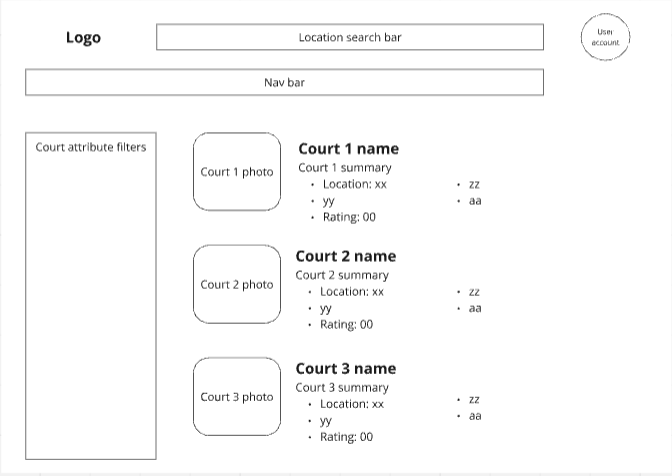
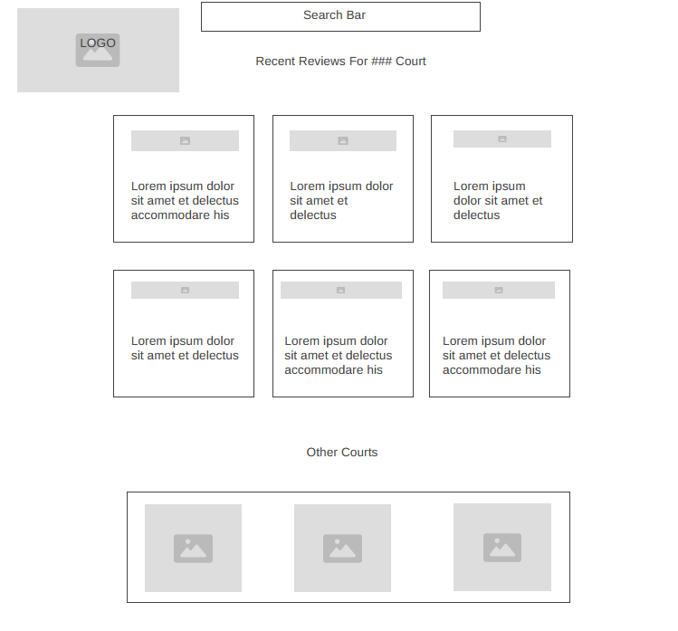
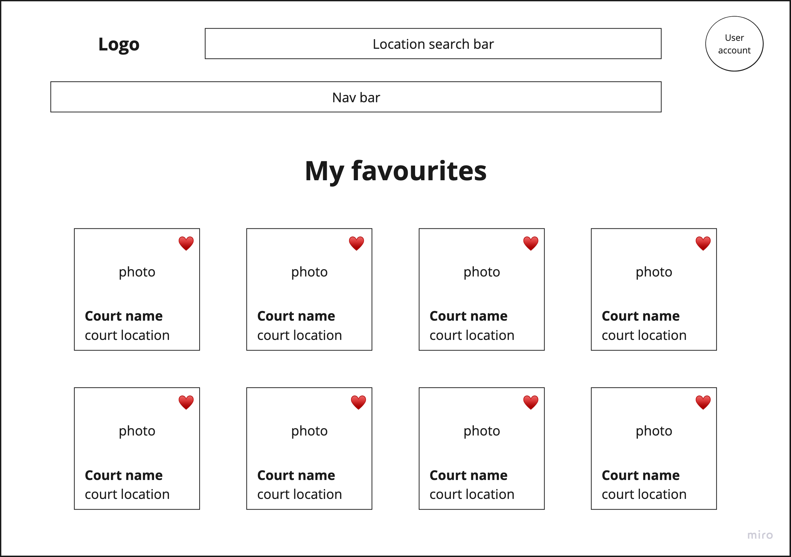

# Court Finder Descriptions

Our service has five main types of pages that we will need to design. First is a main landing page that will welcome users to our service. Next, a search result or court listing page that will allow users to find new courts. Next, a court details page that will hold the information and reviews about a particular basketball court. Next, a page for making a review and rating for a court, where users can submit their findings on a court. Finally, a favorites page where users can save courts in a list for easy access. Here we will go into detain about each type of page.

## Landing Page

- **Page Title:**

- **Page Description:**

- **Parameters:** 

- **Data Needed:**

- **Link Destinations:**

## Search Results

- **Page Title:** Search Results

- **Page Description:** This page will show the user a list of courts that match the user request given in the search bar.

* Search looks for matches in:
    Name
    Address
* Sort by:
    Rating
    Alphabetic
    Price
    Location (State, City, etc.)
    Rating
* Results Show:
    First Gallery Image
    Name of Court
    Average Rating
    Address
    In/Out Door
    Price
    Hours of Operation today, Open or Closed

- **Parameters:** We will need the search input string given by the user to search for matches against name and address in the court table. The route will be `/search?search_entry`

- **Data Needed:** We will search the database containing court entries for matches with the search input, and display the elements of the entries that match. The data needed from that table is listed here.

* CourtID
* Name
* Image
* Rating
* Address
* In-Out Door
* Price
* Hours of Operation (Note: 'Today's' hours and whether the court is open or closed will be determined when the user queries the information and will be displayed dynamically. This info is not stored in the database)

- **Link Destinations:** Clicking on a result will lead the user to the court details page for that result. We will need to pass the CourtID to that page. Users will be able to enter a new search, which will need the new search input. They will be able to return to the main landing page through the nav bar or logo which will not need any info passed to it. They can also navigate to the Favorites page via the nav bar, which will need the <user_id> passed to access. The user can enter a new search query in the search bar, and clicking the search button will take them to a new search results page with the updated query passed.

- **Tests:** We will need a series of tests to verify the rendering of the page. They are:

    1. **Search Functionality:**
       - Verify that entering a valid search query returns a list of courts matching the name or address.
       - Ensure that an empty search query returns an appropriate message (e.g., "No results found").

    2. **Sorting Options:**
       - Test the sorting functionality by verifying that the results can be sorted by each criterion (Rating, Alphabetic, Price, Location) and that the order is correct.
       - Check that the default sorting is set to the highest-rated courts.

    3. **Data Display:**
       - Confirm that each court result displays the correct information: First Gallery Image, Name, Average Rating, Address, In/Out Door status, Price, and Hours of Operation.
       - Validate that today’s hours of operation are accurately determined and displayed based on the current date and time.

    4. **Navigation:**
       - Test that clicking on a court result redirects the user to the correct court details page with the appropriate CourtID passed in the URL.
       - Ensure that navigation to the Favorites page passes the `<user_id>` correctly.
       - Verify that the user can return to the main landing page via the nav bar or logo without any parameters.

    5. **Responsiveness:**
       - Check that the search results page displays correctly across different screen sizes and devices (desktop, tablet, mobile).
       - Ensure that the layout adjusts appropriately and remains user-friendly.

    6. **User Experience:**
       - Validate that the search button is disabled or provides feedback when there is no input in the search bar.
       - Check for loading indicators when results are being fetched to enhance user experience.

    7. **Performance:**
       - Measure the load time for the search results page to ensure it meets acceptable performance standards.
       - Test the responsiveness of the page when searching for different queries to ensure quick rendering of results.

## Court Details

- **Page Title:** Court Details

- **Page Description:** This page will show the user all the collected information about a given basketball court. Below is a list of features with some descriptions and a picture of a wireframe for the page.

* Name of Court
* Court ID
    Unique ID for each court
    Generated upon entry creation.
    Allows courts to have similar/same names (such as YMCA)
    Allows info to be retained when changes are made, such as new court name
    Can be used to associate with other features, such as comments and photo gallery
* Average Rating
    5 Star System
    Users can enter a star rating
    Average of all user submitted ratings is displayed
* Court Quality 
    Series of features and yes no or good average bad
    Determined by user vote?
        * Nets Present
        * Level Court/No Cracks
        * Clean
        * ADA Accessible
        * Equipment Available
* In/Out Doors
    Is the basketball court in-doors or and outside court
* Hours of Operation
    May take several lines if it varies by day
    7 lines max
* Pricing Info
    Marked with the price(s) or as Free
* Location
    Address
    Connect to Google Maps
* Current Weather
    Use Address to pull weather data in the area
* Photo Gallery
    Display one or more photos of the court
* Comment Section
    User provided short reviews

- **Parameters:** We will need to get CourtID when loading the page as it will be the key parameter that is unique to a given court. The route to the page will be `/<court_id>/`.

- **Data Needed:** The table will need to hold data for each feature listed above. Here is a description of the data type.
* Name of Court (VARCHAR)
* Court ID (INT)
* Average Rating (INT:0-5)
* Nets Present (INT: Binary 1 or 0)
* Level Court/No Cracks (INT: Binary 1 or 0)
* Clean (INT: Binary 1 or 0)
* ADA Accessible (INT: Binary 1 or 0)
* Equipment Available (INT: Binary 1 or 0)
* In/Out Doors (INT: Binary 1 or 0)
* Hours of Operation (VARCHAR)
* Pricing Info (FLOAT)
* Location (VARCHAR)
* Photo Gallery Linked table with each image as a row on that table.
    * Court ID that the images are for, linked (INT)
    * Image ID (INT)
    * Image data (VARCHAR?)
* Comment Section Linked table with each comment as a row on that table.
    * Court ID that the images are for, linked (INT)
    * Comment ID (INT)
    * Text data (VARCHAR)

- **Link Destinations:** This page will link several pages. First, it will link to the Make a Review page and will need to pass the CourtID information to it so the resulting review attaches to the correct court. It will have a search bar that will lead to the Search Results page and will need to pass the info put into the search bar on to that page. It will have link in the nav bar to the Main Landing and won't need to pass any data.

- **Tests:** We will need a series of tests to verify the rendering of the page. They are:

    1. **Data Retrieval:**
       - Verify that the correct court details are displayed based on the CourtID parameter.
       - Ensure that all fields (Average Rating, Court Quality, Hours of Operation, etc.) are populated correctly from the database.

    2. **Photo Gallery:**
       - Confirm that the photo gallery displays images linked to the court.
       - Ensure that images load correctly and that navigation through the gallery works.

    3. **Comment Section:**
       - Verify that user comments are displayed correctly.
       - Check that users can submit new comments and that they appear on the page after submission.

    4. **Weather Data:**
       - Ensure that the current weather information is fetched accurately based on the court's address.

    5. **Navigation:**
       - Test that links to the Make a Review page, Search Results page, and Main Landing page work correctly.

## Make a Review

- **Page Title:**
    * Make a Review for [Court Name]

- **Page Description:**
    * Users can submit their review for the basketball court, rate the court on a 5-star system, and provide feedback on specific features like cleanliness, accessibility, and overall experience.

- **Parameters:** 
    * court_id: This will identify which court the review is for, allowing the review to be attached to the correct court in the database.
    * review_id: This will identify a specific review for a court, allowing the review to be stored properly in the database.
- **Data Needed:**
    * Reviewer’s Username: The name or username of the person submitting the review.
    * Rating: A 5-star system where users can click to select how many stars to give the court.
    * Review Text: A textbox for users to provide written feedback.
    * Date: Automatically capture the submission date.
- **Link Destinations:**
    * Court Page: Users can return to the court details page to see their review along with other reviews.
    * Other Courts: Users can be directed to a page listing other courts they may want to review or explore.
    * Search Bar: At the top of the page, allow users to search for another court to review by name or location.

- **Tests:** We will need a series of tests to verify the functionality of the review page. They are:

    1. **Review Submission:**
       - Verify that users can submit a review and that it is correctly linked to the appropriate court.
       - Ensure that the submission form captures all necessary fields (Username, Rating, Review Text, Date).

    2. **Validation:**
       - Test that all required fields must be filled out before submission.
       - Check for appropriate error messages if validation fails.

    3. **Data Display:**
       - Confirm that submitted reviews are displayed correctly on the Court Details page.
       - Ensure that the average rating is updated after a new review is submitted.

    4. **Navigation:**
       - Verify that links to return to the Court Details page and search for other courts function correctly.

## Favorites

- **Page Title:**
    * My Favorites

- **Page Description:**
    * Users can find the courts they have saved on this page and unsave a court if needed.

- **Parameters:** 
    * user_id: required to get the list of court_ids that the user marked as 'favourite'
    
- **Data Needed:**
    * user_id
    * court_id
    * court_name
    * court_location
    * court_image
    
- **Link Destinations:**
    * landing page: users can select the 'home' or similar button to go back to the landing page
    * court details page: users can go to one of the favourited courts by clicking the card image in the favourites list
    * search bar: users can access the search bar at the top of the page to use the regular court search functionality

- **Tests:** We will need a series of tests to verify the functionality of the Favorites page. They are:

    1. **Data Retrieval:**
       - Verify that the correct list of favorite courts is displayed for the user based on the user_id.
       - Ensure that all relevant details (court name, location, image) are shown correctly.

    2. **Unfavorite Functionality:**
       - Test that users can remove a court from their favorites list and that the change is reflected immediately.

    3. **Navigation:**
       - Confirm that links to the landing page and individual court details pages work as expected.

    4. **Search Functionality:**
       - Ensure that the search bar functions properly and allows users to search for other courts.
