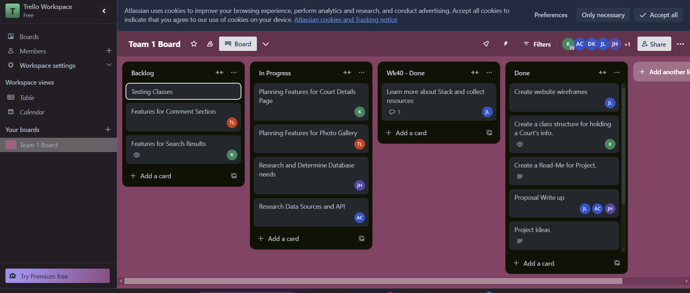
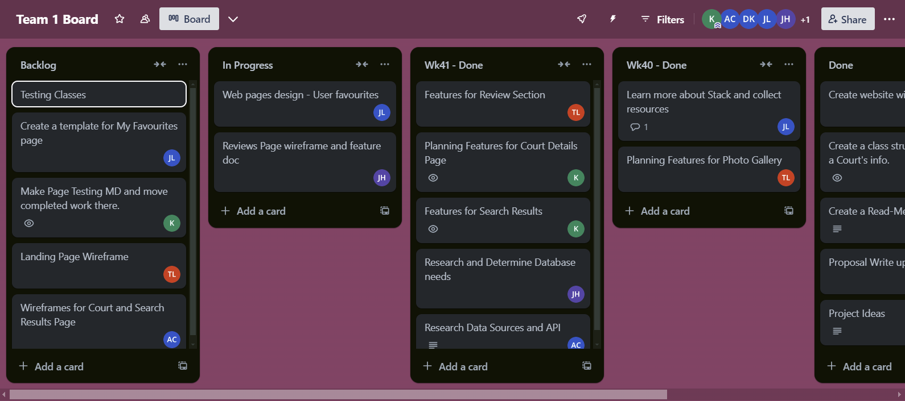
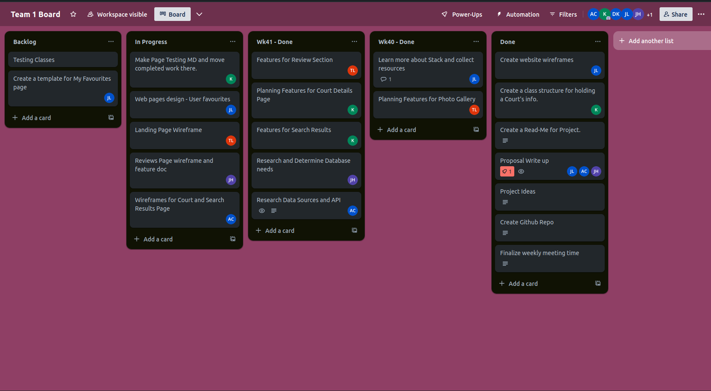
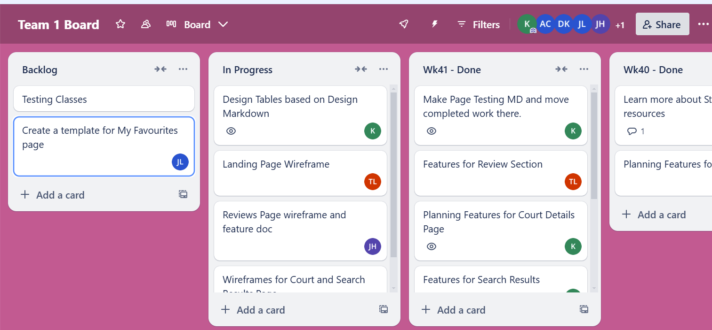
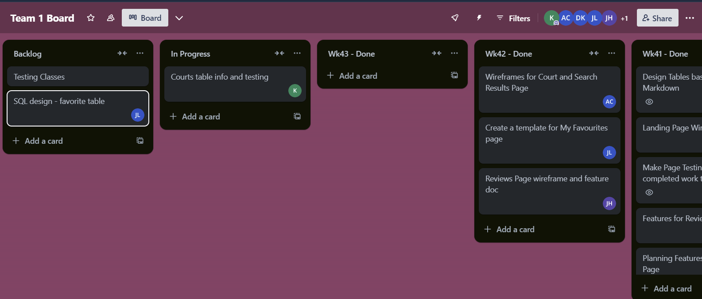
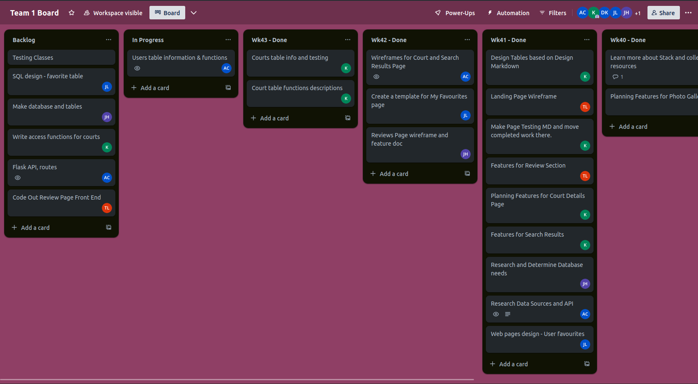
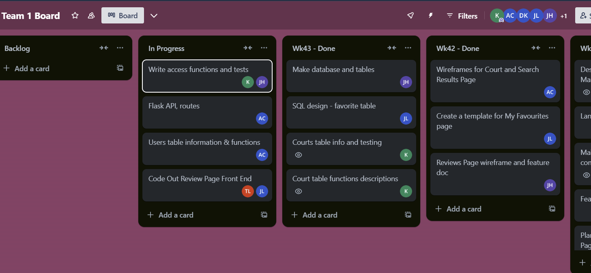

# Week 10/6:

## Goals
This Week: Set-ups and deciding what tools we'll use.
Next Week: Finalize outline for website/page structure and read up on tools we will be using.

## Individual Updates
Kathryn Woessner: Last week, we finalized features for the base court page and updated the frame. Next Week: Features for Search Result Page and website design.

Jonathan Hu: Last week, we researched various databases that could be utilized for our project. I narrowed it between MySQL and MongoDB and ultimately decided that MongoDB would be best as a group. In the upcoming week, I plan on further researching how to use and implement MongoDB for our project.

Toan Lam: For the carousel, I plan on using React; however, this has yet to be determined officially. React manages the core functionality with a single state for the current image index. Framer Motion adds smooth, responsive transitions for sliding images and custom-easing curves. Tailwind CSS provides responsive layouts with utility classes, minimizing custom CSS. Together, React, Framer Motion, and Tailwind offer a scalable, polished UI solution with minimal effort.

Alex Chang: Last week, I researched what external data sources and APIs are available to help us build the CourtFinder app. Google Maps and OpenStreetMap provide APIs for displaying map data, as well as geocoding and extensive data on the location of basketball courts around the world. [Basketball Courts of the World](https://www.courtsoftheworld.com/) is another source of data for basketball courts, which we can scrape data from and cross check with the data from the Google Maps or OpenStreetMap API. This week, I will do more research on these APIs, and explore how I can write an API that would connect these services to our application.

Jaekyeong Lee: Last week, I spent most of my time learning more about the end-to-end web development process and diving deeper into Flask. Since I had already created some basic wireframes the week before, I wanted to get a better idea of the technologies needed to implement the pages presented on the wireframes. This week, I’ll be working with the team to finalise our page designs. I will also try to create a skeleton template for a basketball court entry that will be part of the court details page.

# Week 10/13

## Individual Updates
Kathryn Woessner: Last week I made feature outlines for search results. This week I'll get the file for the next milestone working and move things over that we already have done.

Jonathan Hu: Last week, I spent the majority of my time researching how to use and implement MongoDB for our project. This week, I am working on creating a wireframe and completing the feature doc for the Reviews page in our project.

Jaekyeong Lee: Last week, I made a wireframe for the 'My favourites' page that displays the basketball courts that the user has favourited. This week, I will create a skeleton html and a basic script to render the 'My Favourite' page, along with its design documentation.

Toan Lam: I implemented a review system this week that allows users to submit and view feedback on their experiences. Each review includes a star rating, description, and the reviewer’s name and date.

Alex Chang: Last week, I spent some time researching the Google Maps API (which we decided to use for our project) and which features we could implement in our project. This week, I will be working on a wireframe and documentation for the Search Results page.

# Week 10/20

## Individual Updates

Kathryn Woessner: File for the fourth checkpoint made. Data started to populate. Due to a death in the family last week and next will be low productivity for me.

Alex Chang: Last week, I was busy with other commitments and did not make much progress on the task assigned. This week, I will work on completing the feature documentation and wireframe for the Search Results page in time for the submission and start thinking about how it will be implemented in HTML and CSS. 

Jonathan Hu: Last week, I focused on primarily creating a wireframe for the reviews page on our website along with completing the feature doc for the page. This week I will spend some time working through the database needs.

Jaekyeong Lee: Last week, I contributed to the page design document creation for the 'Favourites' part. This week, I will try to gain more knowledge about database design for the next milestone.

# Week 10/27

## Individual Updates

Kathryn Woessner: Collaborated to finish the fourth checkpoint markdown file. This week I will focus on designing the SQL tables based on decissions made in the last two weeks.

Jaekyeong Lee: Last week, the lab on JavaScript was quite time-consuming so could not work much on the group project. I started drafting the SQL design document to share with the teammates which I will continue working on for the next 2 weeks.

Jonathan Hu: Last week, I spent time transitioning my database layout from Mongo to SQL since we have decided to use SQL instead. This week I plan on filling out the checkpoint 4 markdown file to help support completing the database information. 

Alex Chang: Last week I worked on the feature documentation for the Search Results page. This week I will focus on the SQL design document, and start thinking about how to implement the backend of the website in Flask.

# Week 11/3

## Individual Updates

Kathryn Woessner: Started SQL_TESTING.md and outlined tables and entries that will be needed. This week I will write up the full information for the courts table.

Jonathan Hu: This coming week I plan on completing the reviews table database layout and tests. 

Alex Chang: This week I continued work on the SQL design document and researching the Flask implementation.

Jaekyeong Lee: Last week I couldn't spend much time on the group project as I mostly focused on the course material and on finishing the individual lab. Next week I will start filling up the SQL database design document.

# Week 11/10

## Individual Updates

Kathryn Woessner: Designed courts database table and wrote design for some access methods. Next write up actual access method functions

Jonathan Hu: Last week I spent time completing the writeup for the Reviews and Photos tables in the SQL_Testing markdown. This week I plan on actually creating the database for our project. 

Toan Lam: I finished the last Data Access Method for the edit page. Next, I will code the review page based on our design and plans. 

Alex Chang: This week I finalized work on the SQL design document. Next I will start working on writing a Flask app that we can use to host our site on Render.

Jaekyeong Lee: I contributed to the write-up of the SQL design document for the project milestone, focusing on the details about `favorite` table. This week I will continue to finalise the document.

# Week 11/17

## Individual Updates

Kathryn Woessner: Wrote access methods for creating, deleting, and getting a court. Will write more access methods described in SQL Testing doc.

Jonathan Hu: Last week I completed the code which initializes our database along with creating a test script to ensure the tables were storing data properly. This week, I intend to add the database to our hosting site and run tests to ensure it is accessible remotely.

Jaekyeong Lee: Last week I finalised my portion of the SQL design document (`favorite` table and related functions) for the project milestone. I will start creating the frontend pages for the landing page and court listing page.

Alex Chang: This week I will continue focusing on implementing the backend of the app, starting with a Flask app to handle the routes for displaying pages and some of the basic access methods to the database.

# Week 11/24

## Individual Updates

Kathryn Woessner: Wrote access methods and began writing tests. Will finish writing methods, tests, and debuging methods.